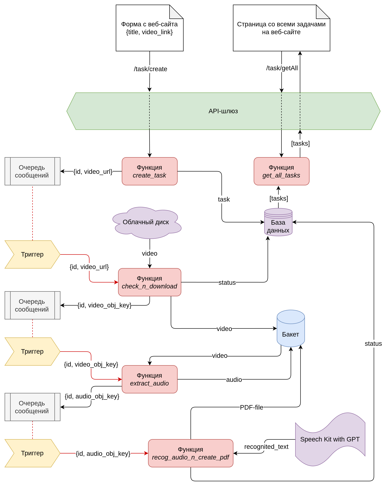

<h1> vvot-hw2 | Имамов Нияз Флурович | группа 11-207 </h1>

# Инструкция по развёртыванию

```shell
wget 'https://github.com/eugeneware/ffmpeg-static/releases/download/b6.1.1/ffmpeg-linux-x64' -O backend/extract_audio/ffmpeg

chmod +x backend/extract_audio/ffmpeg
```

```shell
export YC_TOKEN=$(yc iam create-token)

export TF_VAR_cloud_id=<cloud_id>
export TF_VAR_folder_id=<folder_id>
export TF_VAR_prefix=<prefix>
```

``` shell
cd ./terraform/
```

```shell
terraform init

terraform apply
```

```shell
terraform destroy
```

# Описание архитектуры



# Список использованных Yandex Cloud сервисов

- Object Storage
- Managed Service for YDB
- Message Queue
- Cloud Functions
- Serverless Integrations
- Identity and Access Management
- Lockbox